# Post-contenido — Unidad 3: CSS3 Básico

## Descripción

Repositorio del laboratorio de la Unidad 3 de Programación Web — Séptimo
Semestre. Contiene dos partes: página de perfil con selectores CSS avanzados,
Box Model y posicionamiento (`parte-1-perfil-css3/`) y dashboard responsivo
con CSS Grid y Flexbox (`parte-2-dashboard-grid/`).

**Estudiante:** Neidys Mariana Quintero Carrillo

## Parte 1 — Página de perfil

Página de perfil personal que implementa selectores CSS avanzados,
`box-sizing: border-box`, posicionamiento (fixed/relative/absolute), una
escala de espaciado con Custom Properties (`--space-3xs` a `--space-3xl`),
tipografía fluida con `clamp()` en el nombre de perfil y formulario de
contacto accesible con estados `:focus`. Ver `parte-1-perfil-css3/`.

## Parte 2 — Dashboard con Grid y Flexbox

Dashboard responsivo con layout principal en CSS Grid
(`grid-template-areas`), sidebar y topbar en Flexbox, stat-cards con Grid
auto-fill responsivo, panel de contenido en proporción 2fr/1fr con un tercer
panel ("Notas del Sprint") posicionado mediante colocación explícita de Grid
(`grid-column: 1 / -1`), y tabla de proyectos con franjas zebra vía
`:nth-child(even)`. Sin frameworks CSS externos. Ver `parte-2-dashboard-grid/`.

## Decisiones de diseño

### Parte 1 — Estrategia de especificidad para validación

Se eligió la **Estrategia A**: `input:invalid:not(:placeholder-shown)`.

Se optó por esta estrategia en lugar de `.contact-form input:invalid` porque
aprovecha la validación HTML5 nativa de los atributos `required`/`type="email"`
y solo se activa después de que el usuario haya escrito algo en el campo y
luego lo deje inválido, gracias a `:not(:placeholder-shown)`. Esto evita que
los tres campos requeridos (nombre, email, mensaje) aparezcan en rojo apenas
carga la página, que es el problema que habría que resolver aparte con la
Estrategia B.

En cuanto a especificidad: la regla de error tiene especificidad `0,0,2,0`
(dos pseudo-clases), mientras que `input:focus` del Paso 7 tiene `0,0,1,0`
(una pseudo-clase). Al ser más específica, la regla de error gana sobre el
borde por defecto sin necesitar `!important` ni depender del orden de
declaración en el archivo. Cuando un campo está enfocado y es inválido al
mismo tiempo, ambas reglas conviven sin conflicto real porque controlan
propiedades distintas: `:focus` gobierna el `box-shadow` (el ring azul) y la
regla de error gobierna el `border-color` (rojo). Se verificó en DevTools >
Elements > Styles que ninguna declaración de la hoja de estilos usa
`!important`.

### Parte 2 — Breakpoint y estrategia de layout responsivo

Se eligió un breakpoint de **700px** y la **Estrategia Grid**.

El valor de 700px se determinó probando en DevTools (Toggle device toolbar)
reduciendo el ancho del navegador progresivamente desde 1024px. Por debajo de
este ancho, el sidebar fijo de 220px junto con el panel `2fr/1fr` de
`.content-row` dejaban muy poco espacio horizontal para el contenido
principal, generando texto apretado en las tarjetas y riesgo de
desbordamiento en la tabla de proyectos.

Se prefirió la Estrategia Grid sobre la Estrategia Flex porque permite
conservar las áreas nombradas (`grid-template-areas`) ya definidas en el
Paso 2, redefiniéndolas únicamente dentro del `@media` para una sola columna
(`"topbar" "sidebar" "main"`). Esto evita tener que reordenar visualmente los
elementos con la propiedad `order` o depender del orden de aparición en el
HTML, que sí sería necesario con la Estrategia Flex. Dentro del mismo
breakpoint, `.content-row` pasa a `grid-template-columns: 1fr` para apilar el
panel principal y el lateral, mientras que `.stats-row` no requiere cambios
adicionales porque su `auto-fill` ya se reorganiza solo.

```css
@media (max-width: 700px) {
  .app-layout {
    grid-template-columns: 1fr;
    grid-template-areas:
      "topbar"
      "sidebar"
      "main";
  }

  .sidebar {
    flex-direction: row;
    overflow-x: auto;
  }

  .sidebar__nav {
    flex-direction: row;
  }

  .content-row {
    grid-template-columns: 1fr;
  }
}
```

## Cómo visualizar el proyecto

1. Clonar el repositorio: `git clone https://github.com/neidys06/quintero-post1-u3.git`
2. Abrir la carpeta en Visual Studio Code
3. Clic derecho en `index.html` (de cada parte) → "Open with Live Server"

## Capturas de pantalla

### Parte 1 — Página de perfil

**Box Model con `box-sizing: border-box` activo**
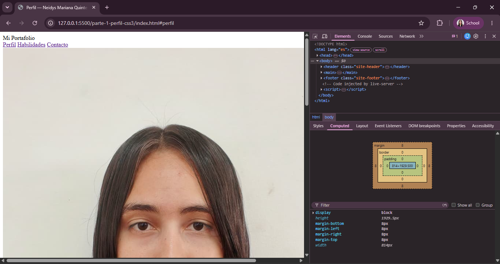

**`.avatar-wrapper` con `position: relative` y badge superpuesto**
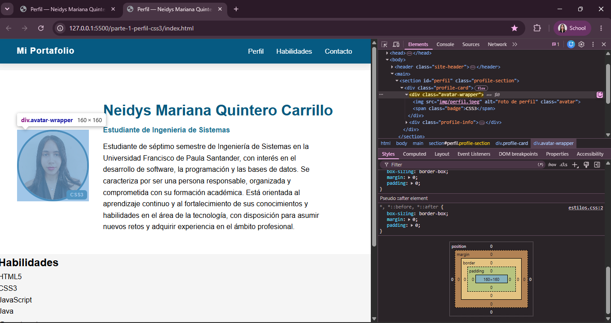

**Tipografía fluida con `clamp()` verificada a 375px**
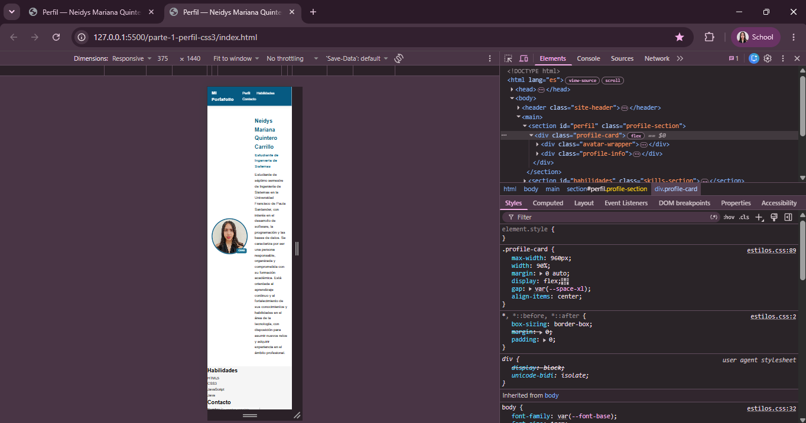

**Página de perfil completa en escritorio**
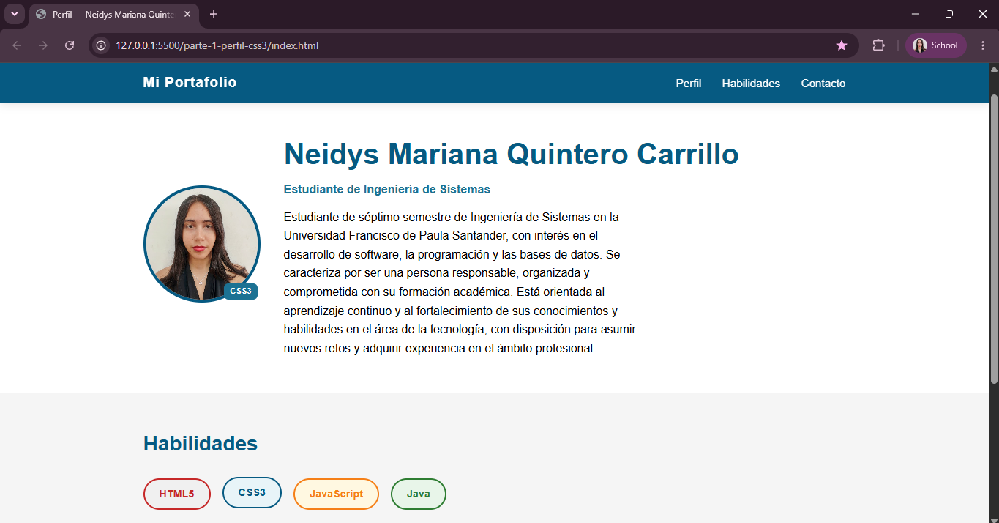

**Formulario de contacto con estado `:focus`**
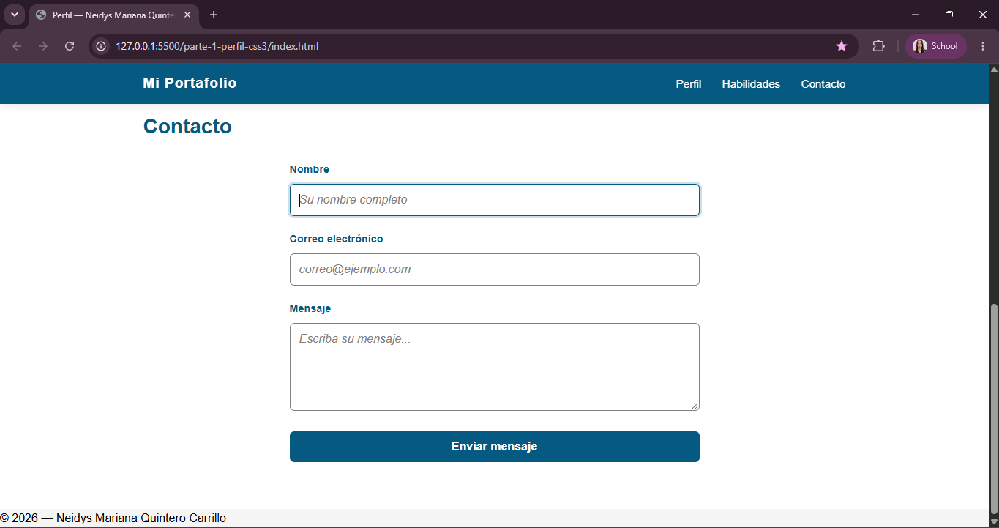

**Estado `:invalid` con borde de alerta, sin romper `:focus` ni usar `!important`**
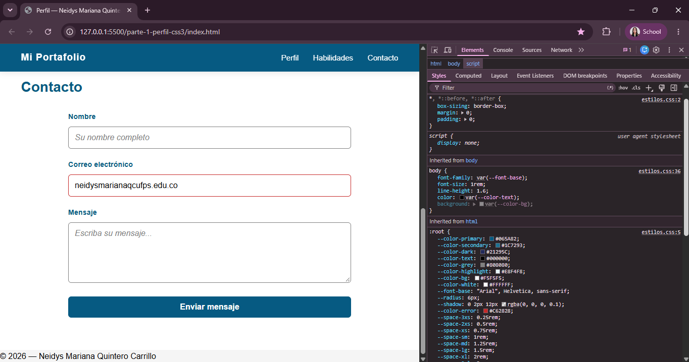

### Parte 2 — Dashboard con Grid y Flexbox

**HTML del dashboard cargado sin estilos, sin errores en consola**
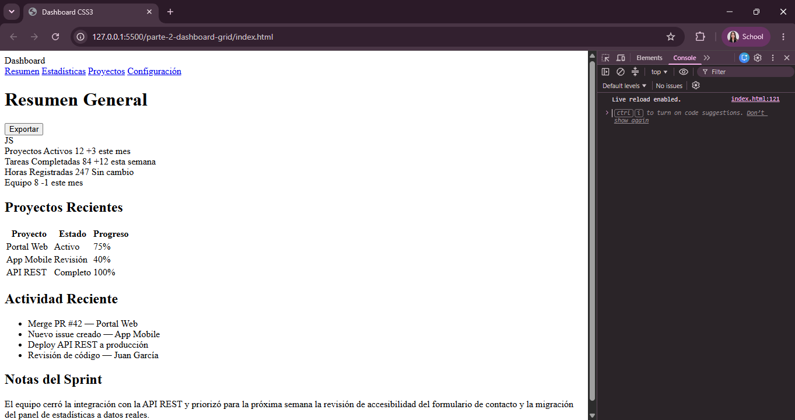

**Overlay de Grid sobre `.app-layout` con las 3 áreas nombradas**
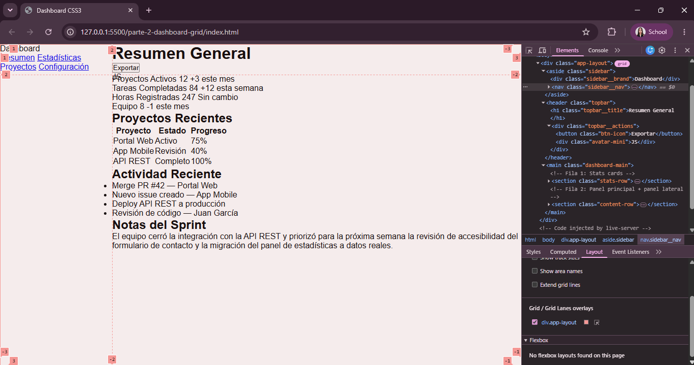

**Overlay de Grid sobre `.stats-row` con columnas `auto-fill`**
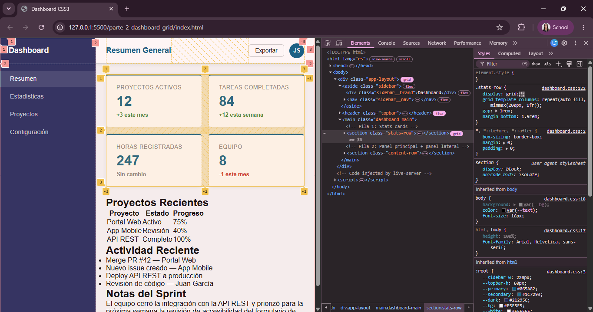

**Dashboard completo con el panel de Styles/código visible en DevTools**
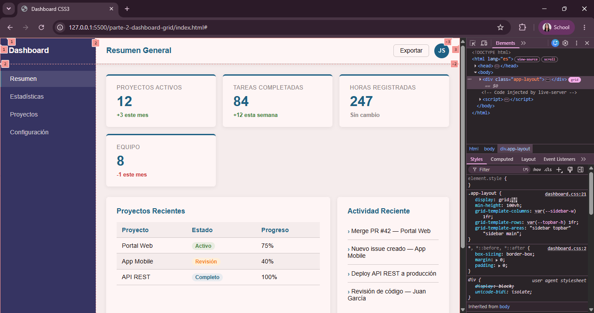

**Dashboard completo en escritorio**
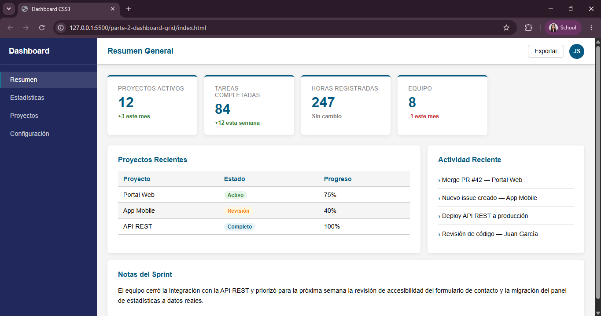

**Layout apilado a 375px confirmando el breakpoint de 700px**
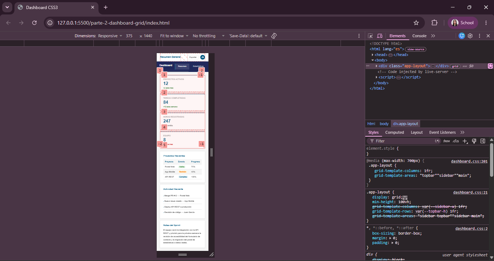